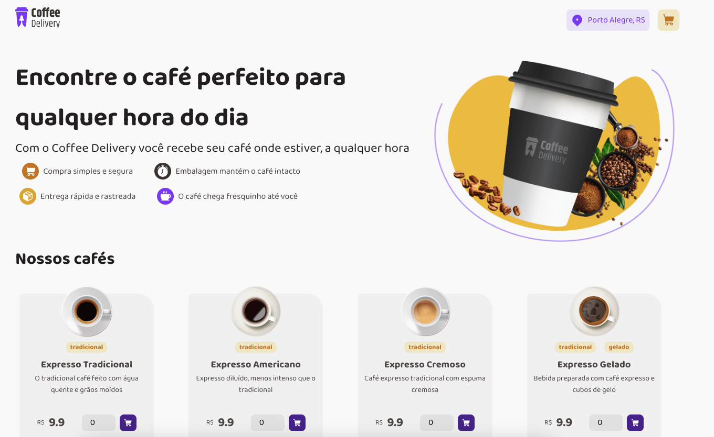
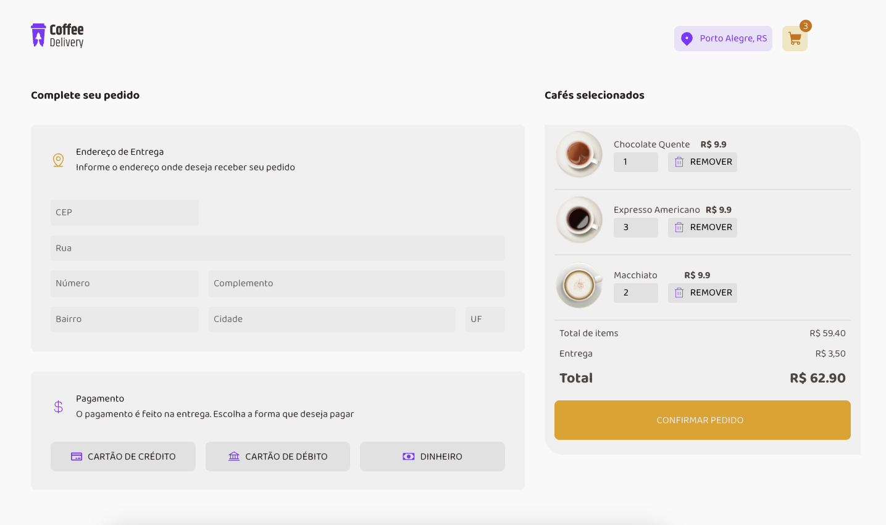

# Coffee Shop Project

Welcome to the Coffee Shop Project! This application allows users to browse and select various coffee options, input their delivery address, and choose a payment method for their order. The project is built using React and JavaScript.

## Screens

## Features

-   **Browse Coffee Options**: Users can view a list of available coffee products and select their desired items.
-   **Add to Cart**: Users can add selected coffee items to their shopping cart.
-   **Delivery Address**: Users can input their delivery address for order fulfillment.
-   **Payment Method**: Users can choose their preferred payment method.
-   **Local Storage**: [TODO] The application uses local storage to save the user's cart items, delivery address, and payment method for a persistent user experience.

## Technologies Used

-   **React**: For building the user interface.
-   **JavaScript**: For application logic.
-   **Local Storage**: For storing user data locally on their device.

## Getting Started

### Prerequisites

Ensure you have the following installed on your machine:

-   Node.js
-   npm (Node Package Manager)
